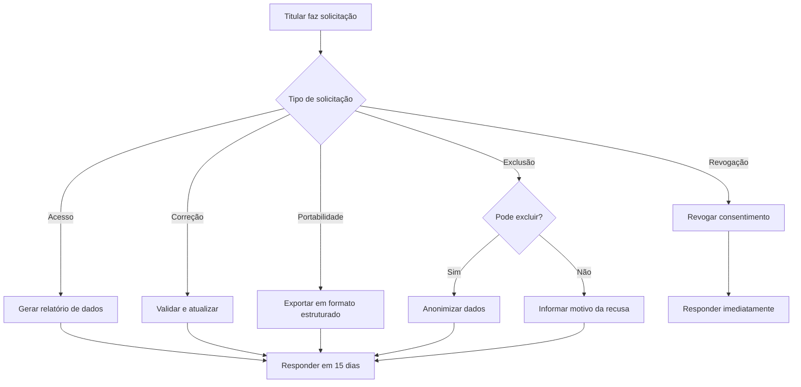

# 3️⃣ Direitos dos Titulares

Os 9 direitos garantidos pela LGPD aos titulares de dados (Art. 18).

## 1. Confirmação e Acesso (Art. 18, I e II)

**Direito**: Confirmar se há tratamento e acessar os dados.

**Prazo**: 15 dias corridos (prorrogável por mais 15).

**Implementação**:
```python
@router.get("/api/lgpd/meus-dados")
async def get_my_data(user: User):
    return {
        "confirmation": True,
        "personal_data": {
            "nome": user.name,
            "cpf": user.cpf,
            "email": user.email,
            "telefone": user.phone,
            "cargo": user.role
        },
        "processing_activities": [
            {
                "purpose": "Autenticação no sistema",
                "legal_basis": "Contrato",
                "retention": "Enquanto ativo + 5 anos"
            }
        ]
    }
```

**Formato**: JSON, PDF ou CSV (escolha do titular).

## 2. Correção (Art. 18, III)

**Direito**: Corrigir dados incompletos, inexatos ou desatualizados.

**Prazo**: 15 dias corridos.

**Implementação**:
```python
@router.patch("/api/lgpd/corrigir-dados")
async def correct_data(user: User, data: UpdateDataDTO):
    # Validar dados
    if data.email:
        validate_email(data.email)
    
    # Atualizar
    user.update(data)
    
    # Log de auditoria
    audit_log.record(
        action="DATA_CORRECTION",
        user_id=user.id,
        fields=data.dict(exclude_unset=True)
    )
    
    return {"message": "Dados atualizados com sucesso"}
```

## 3. Anonimização, Bloqueio ou Eliminação (Art. 18, IV)

**Direito**: Anonimizar, bloquear ou eliminar dados desnecessários, excessivos ou tratados em desconformidade.

**Prazo**: 15 dias corridos.

**Implementação**:
```python
@router.delete("/api/lgpd/excluir-dados")
async def delete_data(user: User, request: DeleteRequestDTO):
    # Verificar se pode excluir
    if user.has_legal_obligation():
        return {
            "status": "blocked",
            "reason": "Obrigação legal de retenção por 5 anos"
        }
    
    # Anonimizar
    user.anonymize()
    
    # Log
    audit_log.record(
        action="DATA_DELETION",
        user_id=user.id,
        reason=request.reason
    )
    
    return {"message": "Dados anonimizados com sucesso"}
```

**Exceções**:
- Obrigação legal de retenção
- Uso exclusivo do controlador (sem acesso a terceiros)
- Exercício regular de direito

## 4. Portabilidade (Art. 18, V)

**Direito**: Receber dados em formato estruturado e interoperável.

**Prazo**: 15 dias corridos.

**Formato**: JSON, CSV ou XML.

**Implementação**:
```python
@router.get("/api/lgpd/exportar-dados")
async def export_data(user: User, format: str = "json"):
    data = {
        "personal_data": user.get_personal_data(),
        "access_logs": user.get_access_logs(),
        "activities": user.get_activities(),
        "exported_at": datetime.now().isoformat()
    }
    
    if format == "json":
        return JSONResponse(data)
    elif format == "csv":
        return CSVResponse(data)
    elif format == "xml":
        return XMLResponse(data)
```

## 5. Informação sobre Compartilhamento (Art. 18, VII)

**Direito**: Saber com quem os dados foram compartilhados.

**Prazo**: 15 dias corridos.

**Implementação**:
```python
@router.get("/api/lgpd/compartilhamentos")
async def get_sharing_info(user: User):
    return {
        "sharing_activities": [
            {
                "recipient": "Prefeitura Municipal",
                "purpose": "Gestão de operadores",
                "date": "2024-01-15",
                "legal_basis": "Contrato"
            }
        ],
        "no_third_party_sharing": True
    }
```

## 6. Informação sobre Não Consentimento (Art. 18, VIII)

**Direito**: Ser informado sobre a possibilidade de não fornecer consentimento e consequências.

**Implementação**:
```python
# No formulário de consentimento
consent_form = {
    "purpose": "Receber notificações por email",
    "optional": True,
    "consequences_of_refusal": "Não receberá alertas por email",
    "can_revoke": True
}
```

## 7. Revogação do Consentimento (Art. 18, IX)

**Direito**: Revogar consentimento a qualquer momento.

**Prazo**: Imediato.

**Implementação**:
```python
@router.post("/api/lgpd/revogar-consentimento")
async def revoke_consent(user: User, consent_id: UUID):
    consent = Consent.get(consent_id)
    
    # Revogar
    consent.revoke()
    
    # Parar tratamento baseado nesse consentimento
    stop_processing_based_on_consent(consent)
    
    # Log
    audit_log.record(
        action="CONSENT_REVOKED",
        user_id=user.id,
        consent_id=consent_id
    )
    
    return {"message": "Consentimento revogado"}
```

## 8. Oposição ao Tratamento (Art. 18, § 2º)

**Direito**: Opor-se ao tratamento realizado com base em legítimo interesse.

**Prazo**: 15 dias para análise.

**Implementação**:
```python
@router.post("/api/lgpd/oposicao")
async def oppose_processing(user: User, request: OppositionDTO):
    # Criar solicitação
    opposition = Opposition.create(
        user_id=user.id,
        reason=request.reason,
        processing_activity=request.activity
    )
    
    # Notificar DPO
    notify_dpo(opposition)
    
    return {
        "protocol": opposition.id,
        "message": "Solicitação registrada. Resposta em até 15 dias."
    }
```

## 9. Revisão de Decisões Automatizadas (Art. 20)

**Direito**: Solicitar revisão de decisões tomadas unicamente com base em tratamento automatizado.

**Prazo**: 15 dias corridos.

**Implementação**:
```python
@router.post("/api/lgpd/revisao-automatizada")
async def review_automated_decision(user: User, decision_id: UUID):
    decision = AutomatedDecision.get(decision_id)
    
    # Criar solicitação de revisão humana
    review = HumanReview.create(
        decision_id=decision_id,
        user_id=user.id,
        status="pending"
    )
    
    # Notificar gestor
    notify_manager(review)
    
    return {
        "protocol": review.id,
        "message": "Revisão humana solicitada"
    }
```

## 📋 Fluxo de Atendimento



## 🔔 Notificações ao Titular

### Obrigatórias
- Alteração na política de privacidade
- Incidente de segurança com risco
- Compartilhamento com terceiros
- Transferência internacional de dados

### Prazo
- Imediato para incidentes graves
- 15 dias para alterações de política

## ✅ Checklist de Direitos

- [ ] Portal de privacidade implementado
- [ ] Endpoint de acesso aos dados
- [ ] Endpoint de correção
- [ ] Endpoint de exclusão/anonimização
- [ ] Endpoint de portabilidade (JSON/CSV)
- [ ] Endpoint de revogação de consentimento
- [ ] Processo de oposição ao tratamento
- [ ] Revisão humana de decisões automatizadas
- [ ] Prazo de 15 dias respeitado
- [ ] Logs de todas as solicitações
