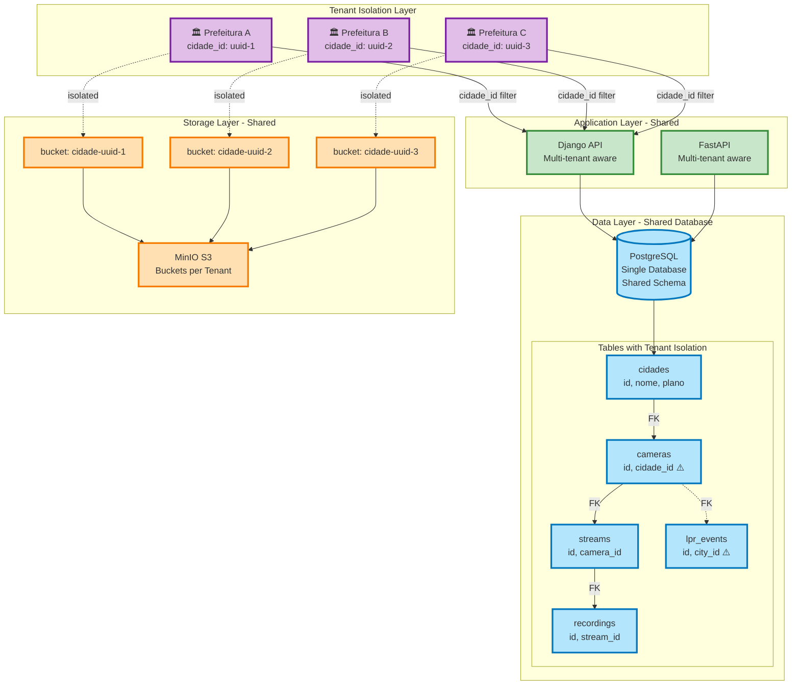
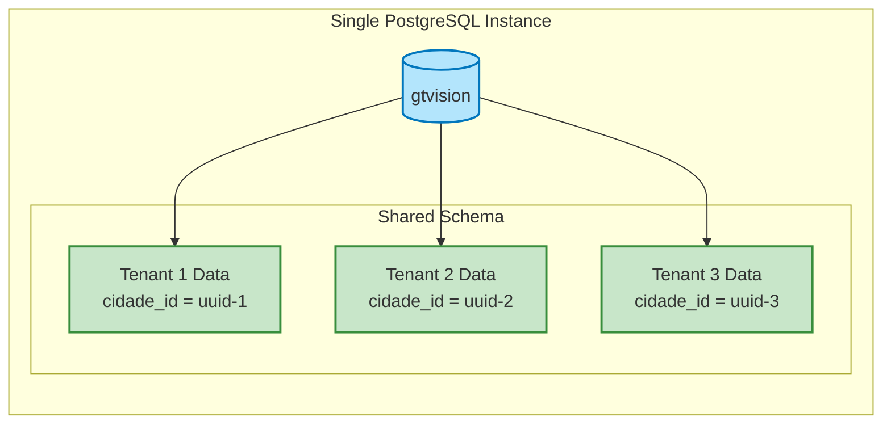
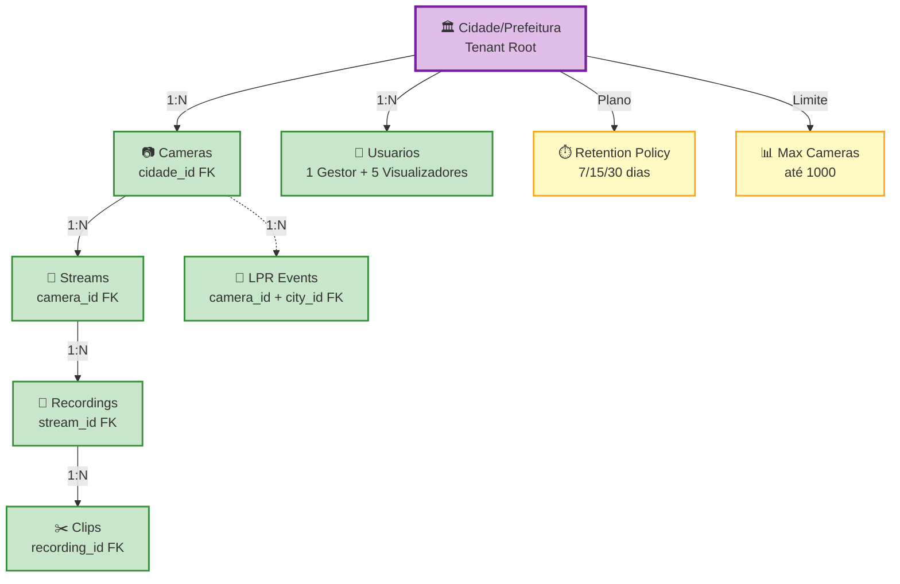
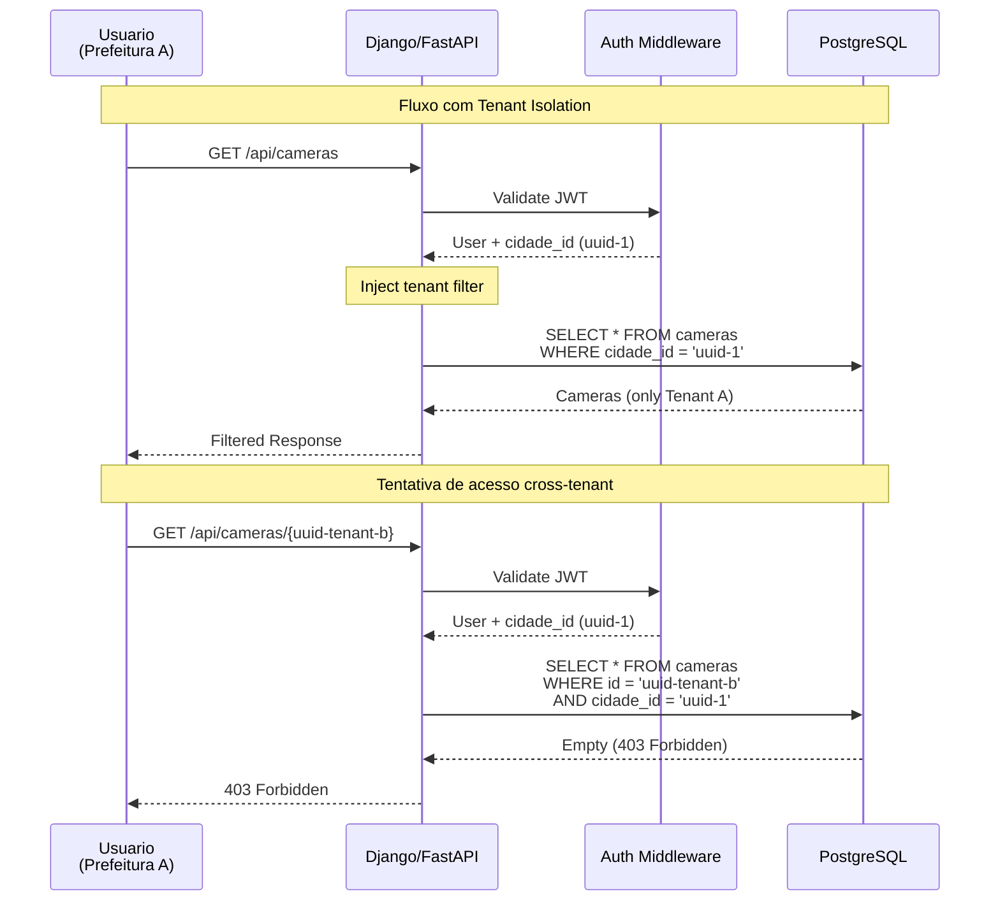
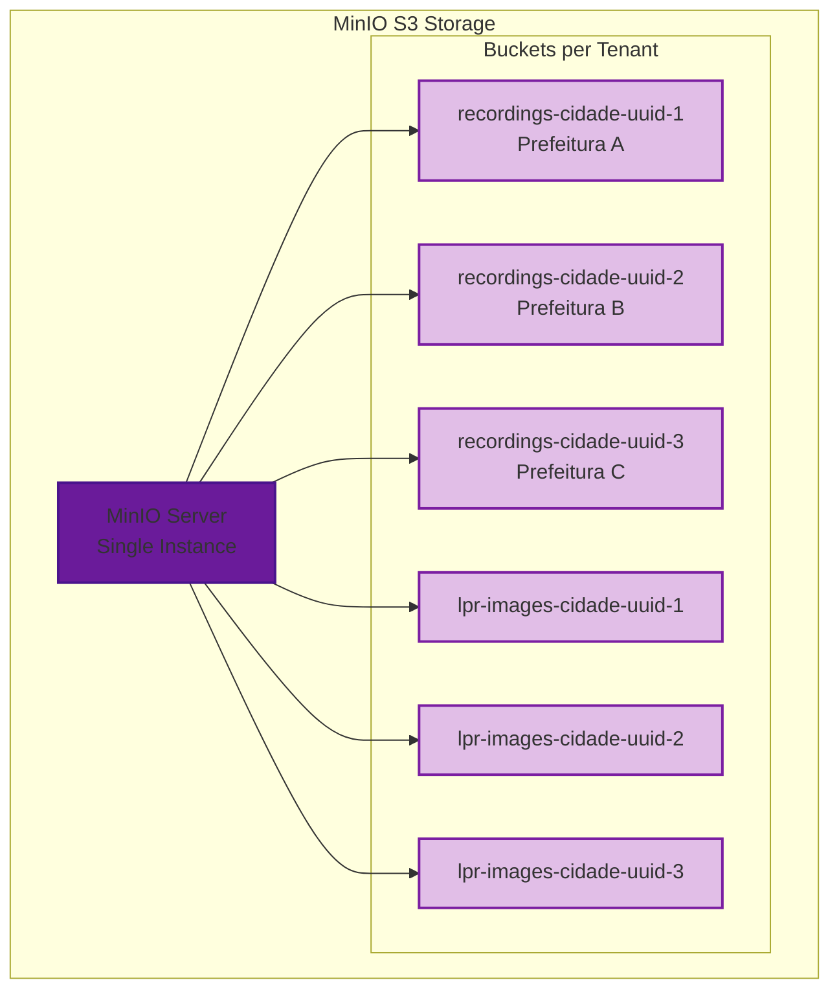
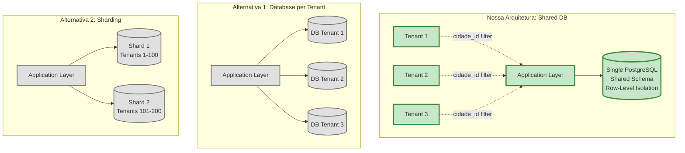
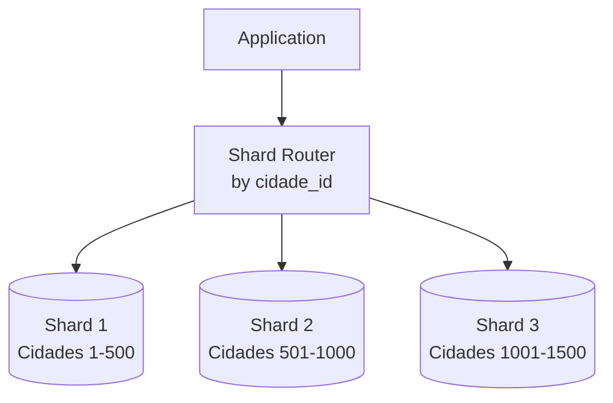
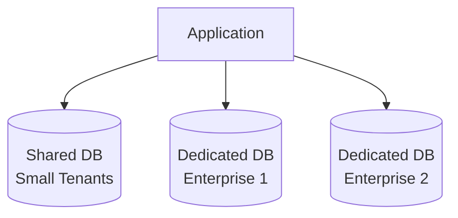

# GT-Vision VMS - Análise de Arquitetura Multi-Tenant

## 🎯 Resposta Direta

**Nossa arquitetura é: MULTI-TENANT com SHARED DATABASE + TENANT ISOLATION**

- ✅ **Multi-tenant**: Sim (múltiplas prefeituras no mesmo sistema)
- ❌ **Hub-and-Spoke**: Não (não temos hub central com spokes distribuídos)
- ❌ **Sharding per Tenant**: Não (todos os tenants no mesmo banco)

**Padrão**: **Shared Database, Shared Schema com Row-Level Tenant Isolation**

---

## 📊 Diagrama de Multi-Tenancy



---

## 🔍 Análise Detalhada

### 1. Modelo de Multi-Tenancy

**Tipo**: **Shared Database, Shared Schema**



**Características**:
- ✅ Um único banco de dados PostgreSQL
- ✅ Um único schema compartilhado
- ✅ Isolamento via `cidade_id` (Foreign Key)
- ✅ Queries filtradas por tenant (WHERE cidade_id = ?)

---

### 2. Hierarquia de Dados (Tenant Isolation)



**Tenant Root**: `Cidade` (Prefeitura)

**Isolamento em Cascata**:
1. `cidades` (tenant root)
2. `cameras` (cidade_id FK) ⚠️ **Ponto de isolamento**
3. `streams` (camera_id FK) → isolado via camera
4. `recordings` (stream_id FK) → isolado via stream
5. `clips` (recording_id FK) → isolado via recording
6. `lpr_events` (city_id FK) ⚠️ **Isolamento direto**

---

### 3. Fluxo de Isolamento de Dados



**Segurança**:
- ✅ JWT contém `cidade_id` do usuário
- ✅ Todas as queries filtram por `cidade_id`
- ✅ Impossível acessar dados de outro tenant
- ✅ Row-Level Security (RLS) pode ser adicionado

---

### 4. Storage Multi-Tenant (MinIO)



**Isolamento de Storage**:
- ✅ Buckets separados por tenant
- ✅ Naming: `{resource}-cidade-{uuid}`
- ✅ IAM policies por bucket
- ✅ Lifecycle policies por tenant (7/15/30 dias)

---

### 5. Comparação de Arquiteturas



---

## 📋 Características da Nossa Arquitetura

### ✅ Vantagens

1. **Simplicidade**
   - Um único banco de dados
   - Schema único e consistente
   - Migrations simples

2. **Custo-Efetivo**
   - Recursos compartilhados
   - Melhor utilização de hardware
   - Menos overhead operacional

3. **Manutenção**
   - Backups centralizados
   - Updates/patches únicos
   - Monitoramento simplificado

4. **Performance**
   - Connection pooling eficiente
   - Cache compartilhado (Redis)
   - Queries otimizadas com índices

### ⚠️ Limitações

1. **Escalabilidade**
   - Limite de ~1000 prefeituras (estimado)
   - Crescimento vertical (scale-up)
   - Não escala horizontalmente por tenant

2. **Isolamento**
   - Risco de "noisy neighbor"
   - Tenant grande pode afetar outros
   - Requer cuidado com queries

3. **Compliance**
   - Dados de todos os tenants no mesmo DB
   - Pode não atender requisitos de isolamento físico
   - LGPD: dados misturados (mas isolados logicamente)

---

## 🔧 Implementação Atual

### Código de Isolamento

```python
# src/cidades/domain/aggregates/cidade.py
class Cidade(AggregateRoot):
    """Tenant Root - Prefeitura"""
    
    def __init__(self, entity_id: UUID, nome: str, cnpj: CNPJ):
        self.id = entity_id  # Tenant ID
        self.nome = nome
        self.cameras: List[Camera] = []  # Owned by tenant
        self.usuarios: List[Usuario] = []  # Owned by tenant
```

### Schema SQL

```sql
-- Tenant Root
CREATE TABLE cidades (
    id UUID PRIMARY KEY,
    nome VARCHAR(255),
    plano_retencao_dias INTEGER
);

-- Tenant-scoped data
CREATE TABLE cameras (
    id UUID PRIMARY KEY,
    cidade_id UUID REFERENCES cidades(id),  -- ⚠️ Tenant FK
    nome VARCHAR(255)
);

CREATE INDEX idx_cameras_cidade ON cameras(cidade_id);  -- ⚠️ Performance
```

### Query Pattern

```python
# Sempre filtrar por tenant
cameras = db.query(Camera).filter(
    Camera.cidade_id == current_user.cidade_id  # ⚠️ Tenant filter
).all()
```

---

## 🚀 Evolução Futura

### Opção 1: Adicionar Sharding (se crescer muito)



### Opção 2: Database per Tenant (para clientes enterprise)



---

## 📊 Resumo Executivo

| Aspecto | Nossa Implementação |
|---------|---------------------|
| **Padrão** | Shared Database, Shared Schema |
| **Isolamento** | Row-Level (cidade_id FK) |
| **Escalabilidade** | Vertical (até ~1000 tenants) |
| **Custo** | Baixo (recursos compartilhados) |
| **Complexidade** | Baixa (single DB) |
| **Segurança** | Média (isolamento lógico) |
| **Performance** | Alta (cache compartilhado) |
| **Manutenção** | Fácil (single schema) |

---

## ✅ Conclusão

**Nossa arquitetura é MULTI-TENANT com:**
- ✅ Shared Database (PostgreSQL único)
- ✅ Shared Schema (tabelas compartilhadas)
- ✅ Row-Level Isolation (cidade_id FK)
- ✅ Bucket Isolation (MinIO per tenant)

**NÃO é:**
- ❌ Hub-and-Spoke (não temos hub central)
- ❌ Sharding (não particionamos por tenant)
- ❌ Database per Tenant (não temos DBs separados)

**Adequado para**: 10-1000 prefeituras de pequeno/médio porte

**Migração futura**: Sharding ou DB per Tenant se ultrapassar 1000 tenants
