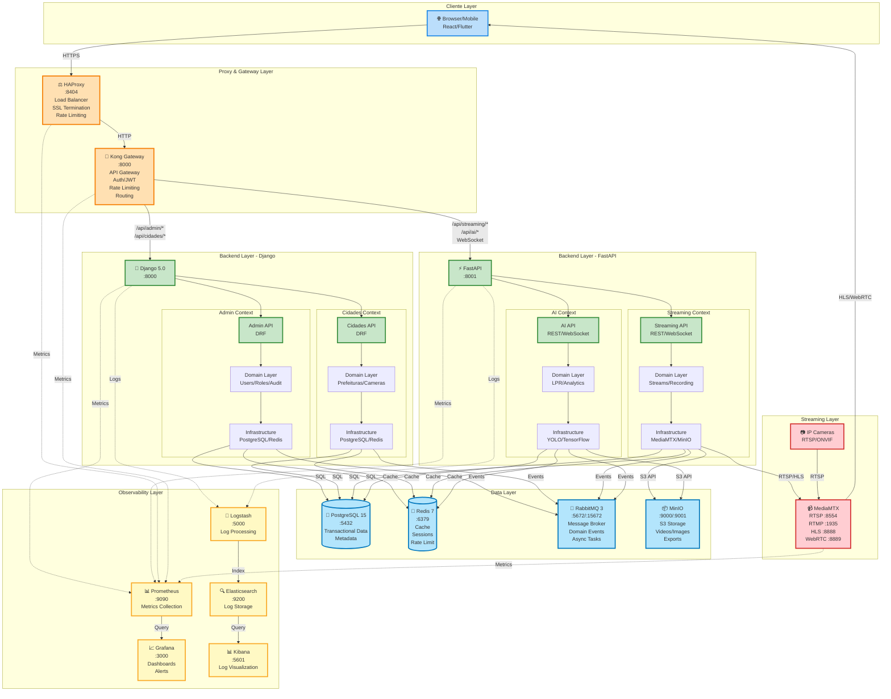
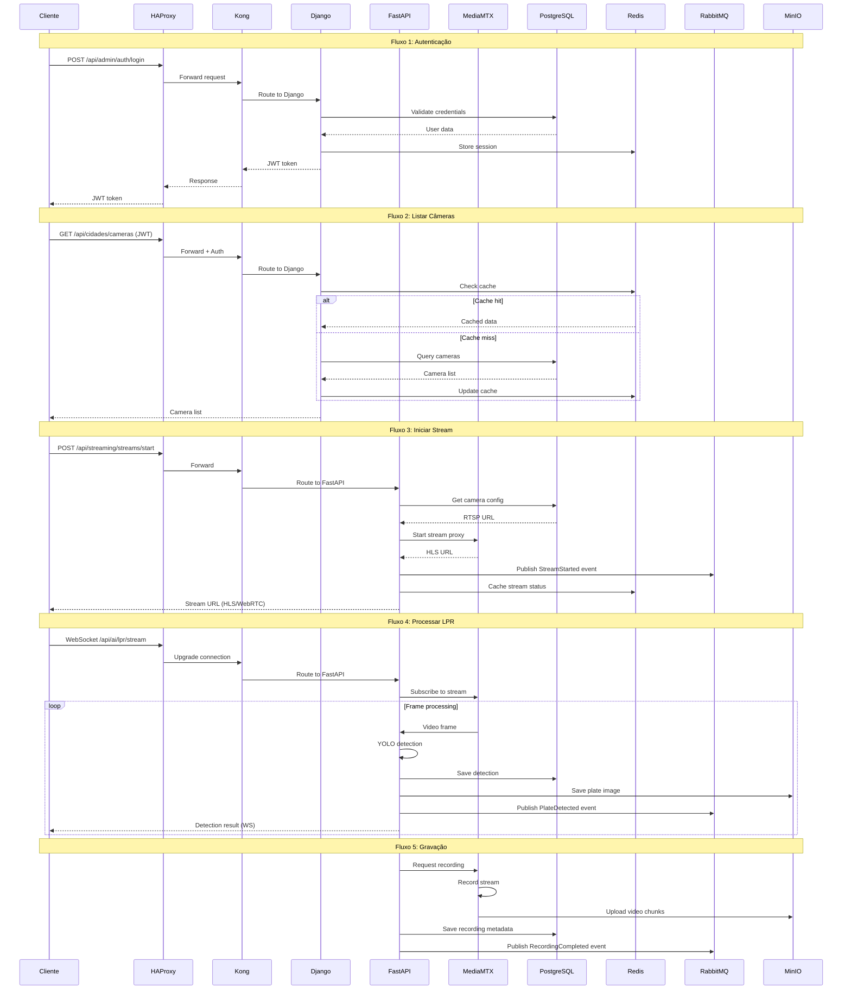
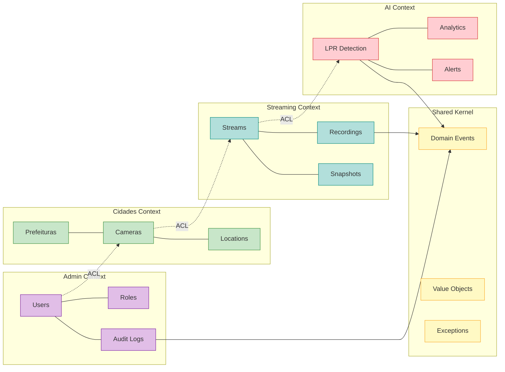
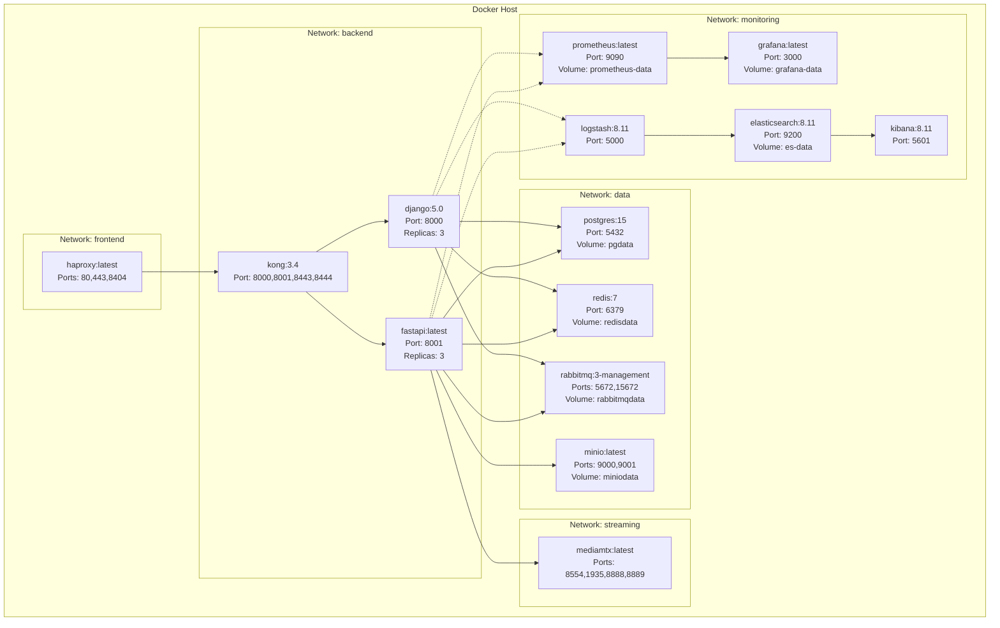

# GT-Vision VMS - Arquitetura Completa (Mermaid)

## Diagrama de Arquitetura Geral

## Diagrama de Fluxo de Dados

## Diagrama de Bounded Contexts (DDD)

## Diagrama de Deployment (Docker)

## Descrição Detalhada dos Componentes

### 1. Cliente Layer
- **Tecnologia**: React (Web) / Flutter (Mobile)
- **Responsabilidade**: Interface do usuário, consumo de APIs
- **Comunicação**: HTTPS, WebSocket
- **Autenticação**: JWT Bearer Token

### 2. Proxy & Gateway Layer

#### HAProxy (:8404)
- **Função**: Load Balancer de entrada
- **Recursos**:
  - SSL/TLS Termination
  - Rate Limiting (1000 req/min)
  - Health Checks
  - Sticky Sessions
  - Stats Dashboard (:8404/stats)
- **Algoritmo**: Round Robin com health checks

#### Kong Gateway (:8000)
- **Função**: API Gateway e roteamento
- **Plugins**:
  - JWT Authentication
  - Rate Limiting (100 req/min por IP)
  - CORS
  - Request/Response Transformation
  - Logging
- **Rotas**:
  - `/api/admin/*` → Django
  - `/api/cidades/*` → Django
  - `/api/streaming/*` → FastAPI
  - `/api/ai/*` → FastAPI

### 3. Backend Layer

#### Django 5.0 (:8000)
- **Contexts**: Admin, Cidades
- **Framework**: Django + Django REST Framework
- **Padrão**: DDD (Domain-Driven Design)
- **Camadas**:
  - **API**: Controllers REST (DRF ViewSets)
  - **Application**: Use Cases, DTOs
  - **Domain**: Entities, Value Objects, Domain Services
  - **Infrastructure**: Repositories, ORM, External Services
- **Autenticação**: JWT (djangorestframework-simplejwt)
- **Validação**: Django Forms + Serializers
- **Admin**: Django Admin customizado

**Admin Context**:
- Gestão de usuários e permissões
- Auditoria de ações
- Configurações do sistema
- Multi-tenancy (prefeituras)

**Cidades Context**:
- Cadastro de prefeituras
- Gestão de câmeras
- Localizações e zonas
- Configurações de câmeras

#### FastAPI (:8001)
- **Contexts**: Streaming, AI
- **Framework**: FastAPI + Uvicorn
- **Padrão**: DDD + Async/Await
- **Camadas**:
  - **API**: Routers REST + WebSocket
  - **Application**: Use Cases assíncronos
  - **Domain**: Entities, Aggregates, Domain Events
  - **Infrastructure**: Async Repositories, External APIs
- **WebSocket**: Real-time para streaming e detecções
- **Background Tasks**: Celery + RabbitMQ
- **Validação**: Pydantic Models

**Streaming Context**:
- Proxy de streams RTSP → HLS/WebRTC
- Gravação de vídeos
- Snapshots e thumbnails
- Gestão de sessões de streaming

**AI Context**:
- Detecção de placas (LPR) com YOLO
- Analytics de tráfego
- Alertas inteligentes
- Processamento de frames em tempo real

### 4. Streaming Layer

#### MediaMTX
- **Função**: Servidor de streaming multi-protocolo
- **Protocolos**:
  - **RTSP (:8554)**: Ingestão de câmeras IP
  - **RTMP (:1935)**: Alternativa para ingestão
  - **HLS (:8888)**: Playback em browsers
  - **WebRTC (:8889)**: Baixa latência (<1s)
- **Recursos**:
  - Transcodificação automática
  - Recording em MP4/HLS
  - Authentication via HTTP hooks
  - Metrics para Prometheus

### 5. Data Layer

#### PostgreSQL 15 (:5432)
- **Função**: Database relacional principal
- **Schemas**:
  - `admin`: Users, Roles, Audit
  - `cidades`: Prefeituras, Cameras, Locations
  - `streaming`: Streams, Recordings
  - `ai`: Detections, Analytics, Alerts
- **Recursos**:
  - JSONB para metadados
  - Full-text search
  - Particionamento por data
  - Replicação (futuro)
- **Backup**: Daily automated backups

#### Redis 7 (:6379)
- **Função**: Cache distribuído e session store
- **Uso**:
  - Cache de queries (TTL: 5min)
  - Session storage (JWT blacklist)
  - Rate limiting counters
  - Real-time stream status
  - Pub/Sub para notificações
- **Persistência**: RDB + AOF

#### RabbitMQ 3 (:5672, :15672)
- **Função**: Message broker para eventos assíncronos
- **Exchanges**:
  - `domain.events`: Domain Events (fanout)
  - `tasks`: Background tasks (direct)
  - `notifications`: User notifications (topic)
- **Queues**:
  - `stream.processing`: Processamento de streams
  - `ai.detection`: Detecções LPR
  - `recording.jobs`: Jobs de gravação
  - `notifications.email`: Envio de emails
- **Dead Letter Queue**: Para retry de mensagens

#### MinIO (:9000, :9001)
- **Função**: Object storage S3-compatible
- **Buckets**:
  - `recordings`: Vídeos gravados (MP4/HLS)
  - `snapshots`: Imagens de câmeras
  - `lpr-images`: Placas detectadas
  - `exports`: Exports de relatórios
- **Lifecycle**: Retenção de 90 dias
- **Versioning**: Habilitado
- **Encryption**: Server-side (SSE)

### 6. Observability Layer

#### Prometheus (:9090)
- **Função**: Coleta e armazenamento de métricas
- **Métricas**:
  - Request rate, latency, errors (RED)
  - CPU, memory, disk (USE)
  - Custom business metrics
- **Scrape Interval**: 15s
- **Retention**: 15 dias

#### Grafana (:3000)
- **Função**: Visualização e alertas
- **Dashboards**:
  - System Overview
  - API Performance
  - Streaming Health
  - AI Detection Stats
  - Business Metrics
- **Alertas**: Email, Slack, PagerDuty

#### ELK Stack

**Elasticsearch (:9200)**:
- Armazenamento de logs
- Full-text search
- Retention: 30 dias

**Logstash (:5000)**:
- Coleta e processamento de logs
- Parsing e enrichment
- Filtros por severidade

**Kibana (:5601)**:
- Visualização de logs
- Dashboards de troubleshooting
- Alertas de erros

## Fluxos Principais

### Fluxo 1: Autenticação
1. Cliente envia credenciais para `/api/admin/auth/login`
2. HAProxy encaminha para Kong
3. Kong roteia para Django
4. Django valida no PostgreSQL
5. Django gera JWT e armazena session no Redis
6. Cliente recebe JWT para requests subsequentes

### Fluxo 2: Iniciar Stream
1. Cliente solicita stream via `/api/streaming/streams/start`
2. Kong autentica JWT e roteia para FastAPI
3. FastAPI busca config da câmera no PostgreSQL
4. FastAPI solicita proxy do stream no MediaMTX
5. MediaMTX conecta na câmera via RTSP
6. MediaMTX gera URL HLS/WebRTC
7. FastAPI publica evento `StreamStarted` no RabbitMQ
8. FastAPI retorna URL para cliente

### Fluxo 3: Detecção LPR
1. Cliente conecta WebSocket em `/api/ai/lpr/stream`
2. FastAPI subscreve ao stream no MediaMTX
3. Para cada frame:
   - FastAPI processa com YOLO
   - Detecta placas
   - Salva imagem no MinIO
   - Salva detecção no PostgreSQL
   - Publica evento `PlateDetected` no RabbitMQ
   - Envia resultado via WebSocket para cliente

### Fluxo 4: Gravação
1. FastAPI solicita gravação ao MediaMTX
2. MediaMTX grava chunks de vídeo
3. MediaMTX faz upload para MinIO
4. FastAPI salva metadata no PostgreSQL
5. Ao finalizar, publica evento `RecordingCompleted`

## Escalabilidade

- **Horizontal**: Django e FastAPI com múltiplas réplicas
- **Load Balancing**: HAProxy distribui carga
- **Cache**: Redis reduz load no PostgreSQL
- **Async**: RabbitMQ para processamento assíncrono
- **Storage**: MinIO escalável com múltiplos nodes

## Segurança

- **SSL/TLS**: Terminação no HAProxy
- **JWT**: Autenticação stateless
- **Rate Limiting**: HAProxy + Kong
- **CORS**: Configurado no Kong
- **Input Validation**: Pydantic + DRF Serializers
- **SQL Injection**: ORM (Django ORM + SQLAlchemy)
- **Secrets**: Variáveis de ambiente + Vault (futuro)

## Performance

- **Cache Hit Rate**: >80% (Redis)
- **API Latency**: <100ms (p95)
- **Stream Latency**: <3s (HLS), <1s (WebRTC)
- **LPR Processing**: <200ms por frame
- **Database Connections**: Pool de 20 conexões
- **Concurrent Streams**: 100+ por instância FastAPI
